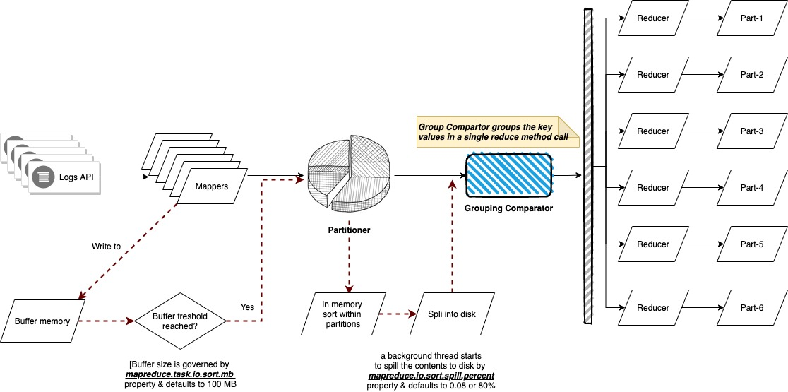

### Input

The input will be a set of files, where each record (line) will have the following format:

```
Format:
        <year><,><month><,><day><,><temperature>

Example:
        2012, 01, 01, 35
        2011, 12, 23, -4
```

### Expected Output

The expected output will have the following format:
```
Format:
        <year><-><month>: <temperature1><,><temperature2><,> ...
        where temperature1 <= temperature2 <= ...

Example:
        2012-01:  5, 10, 35, 45, ...
        2001-11: 40, 46, 47, 48, ...
        2005-08: 38, 50, 52, 70, ...
```


The difference in the results between 

- With `DateTemperatureGroupingComparator`
```
201301	90,80,70,-10,
201212	70,60,30,10,-20,
200012	10,-20,
200011	30,20,-40,

```
- Without
```
201301	90,
201301	80,
201301	70,
201301	-10,
201212	70,
201212	60,
201212	30,
201212	10,
201212	-20,
200012	10,
200012	-20,
200011	30,
200011	20,
200011	-40,
```
**Important Note: This lab description is copied from** https://www.oreilly.com/library/view/data-algorithms/9781491906170/ch01.html

**All the copyrights for this code and the text is belong to chapter.01 in the data algorithms book.** 


# Secondary Sort: Introduction

A secondary sort problem relates to sorting values associated with a key in the reduce phase. Sometimes, it is called `value-to-key` conversion. The secondary sorting technique will enable us to sort the values (in ascending or descending order) passed to each reducer.

The goal of this lab is to implement the Secondary Sort design pattern in MapReduce/Hadoop. The MapReduce framework automatically sorts the keys generated by mappers. This means that, before starting reducers, all intermediate key-value pairs generated by mappers must be sorted by key (and not by value). Values passed to each reducer are not sorted at all; they can be in any order. What if you also want to sort a reducer’s values? MapReduce/Hadoop and Spark do not sort values for a reducer. So, for those applications (such as time series data) in which you want to sort your reducer data, the Secondary Sort design pattern enables you to do so.

First we’ll focus on the MapReduce/Hadoop solution. Let’s look at the MapReduce paradigm and then unpack the concept of the secondary sort:

- `map(key1, value1) → list(key2, value2)`
- `reduce(key2, list(value2)) → list(key3, value3)`

First, the map() function receives a key-value pair input, (key1, value1). Then it outputs any number of key-value pairs, (key2, value2). Next, the reduce() function receives as input another key-value pair, (key2, list(value2)), and outputs any number of (key3, value3) pairs.

Now consider the following key-value pair, (key2, list(value2)), as an input for a reducer:

- `list(value2) = (V1, V2, ..., Vn)`

where there is no ordering between reducer values (`V1, V2, ..., Vn`).

The goal of the Secondary Sort pattern is to give some ordering to the values received by a reducer. So, once we apply the pattern to our MapReduce paradigm, then we will have:

- `SORT(V1, V2, ..., Vn) = (S1, S2, ..., Sn)`
- `list(value2) = (S1, S2, ..., Sn)`

where:

- `S1 < S2 < ... < Sn (ascending order)`, or 
- `S1 > S2 > ... > Sn (descending order)`

Here is an example of a secondary sorting problem: consider the temperature data from a scientific experiment. A dump of the temperature data might look something like the following (columns are year, month, day, and daily temperature, respectively):

```
2012, 01, 01, 5
2012, 01, 02, 45
2012, 01, 03, 35
2012, 01, 04, 10
...
2001, 11, 01, 46
2001, 11, 02, 47
2001, 11, 03, 48
2001, 11, 04, 40
...
2005, 08, 20, 50
2005, 08, 21, 52
2005, 08, 22, 38
2005, 08, 23, 70
```

Suppose we want to output the temperature for every year-month with the values sorted in ascending order. Essentially, we want the reducer values iterator to be sorted. Therefore, we want to generate something like this output (the first column is year-month and the second column is the sorted temperatures):

```
2012-01:  5, 10, 35, 45, ...
2001-11: 40, 46, 47, 48, ...
2005-08: 38, 50, 52, 70, ...
```

Solutions to the Secondary Sort Problem

There are at least two possible approaches for sorting the reducer values. These solutions may be applied to both the MapReduce/Hadoop and Spark frameworks:

- The first approach involves having the reducer read and buffer all of the values for a given key (in an array data structure, for example), then doing an `in-reducer sort on the values`. This approach will `not scale`: since the reducer _will be receiving all values for a given key_, this approach might cause the reducer to `run out of memory (java.lang.OutOfMemoryError)`. On the other hand, this approach can work well if the number of values is small enough that it will not cause an out-of-memory error.
- The second approach involves using the MapReduce framework for sorting the reducer values (this does not require in-reducer sorting of values passed to the reducer). This approach consists of `creating a composite key by adding a part of, or the entire value to, the natural key to achieve your sorting objectives.`
  This option is scalable and will not generate out-of-memory errors. Here, we basically offload the sorting to the MapReduce framework (sorting is a paramount feature of the MapReduce/Hadoop framework).


This is a summary of the second approach:

- Use the Value-to-Key Conversion design pattern: form a composite intermediate key, (K, V1), where V1 is the secondary key. Here, K is called a natural key. To inject a value (i.e., V1) into a reducer key, simply create a composite key (for details, see the DateTemperaturePair class). In our example, V1 is the temperature data. 
- Let the MapReduce execution framework do the sorting (rather than sorting in memory, let the framework sort by using the cluster nodes).
- Preserve state across multiple key-value pairs to handle processing; you can achieve this by having proper mapper output partitioners (for example, we partition the mapper’s output by the natural key).

## Implementation Details

To implement the secondary sort feature, we need additional plug-in Java classes. We have to tell the MapReduce/Hadoop framework:

- How to sort reducer keys
- How to partition keys passed to reducers (custom partitioner)
- How to group data that has arrived at each reducer


### DateTemperaturePair

```java
public class DateTemperaturePair implements Writable, WritableComparable<DateTemperaturePair> {

  DateTemperaturePair(Text yearMonth, Text day, IntWritable temperature);
  // more dummy code

  public int compareTo(DateTemperaturePair pair) {
    int compareValue = this.yearMonth.compareTo(pair.getYearMonth());
    if (compareValue == 0) {
      compareValue = temperature.compareTo(pair.getTemperature());
    }
    //return compareValue;    // sort ascending
    return -1*compareValue;   // sort descending
  }
}
```

### Custom partitioner

The partitioner decides which mapper’s output goes to which reducer based on the mapper’s output key. For this, we need two plug-in classes:

- A custom partitioner to control which reducer processes which keys. The custom partitioner ensures that all data with the same key (the natural key, not including the composite key with the temperature value) is sent to the same reducer
- A custom Comparator to sort reducer values. The custom Comparator does sorting so that the natural key (year-month) groups the data once it arrives at the reducer.

```java
import org.apache.hadoop.io.Text;
import org.apache.hadoop.mapreduce.Partitioner;

public class DateTemperaturePartitioner extends Partitioner<DateTemperaturePair, Text> {
    @Override
    public int getPartition(DateTemperaturePair pair,
                            Text text,
                             int numberOfPartitions) {
         // make sure that partitions are non-negative
         return Math.abs(pair.getYearMonth().hashCode() % numberOfPartitions);
      }
 }
```

```java
import org.apache.hadoop.io.WritableComparable;
import org.apache.hadoop.io.WritableComparator;

public class DateTemperatureGroupingComparator extends WritableComparator {
    public DateTemperatureGroupingComparator() {
        super(DateTemperaturePair.class, true);
    }

     @Override
     /**
      * This comparator controls which keys are grouped
      * together into a single call to the reduce() method
      */
     public int compare(WritableComparable wc1, WritableComparable wc2) {
         DateTemperaturePair pair = (DateTemperaturePair) wc1;
         DateTemperaturePair pair2 = (DateTemperaturePair) wc2;
         return pair.getYearMonth().compareTo(pair2.getYearMonth());
     }
 }
```

### Mapper

```java
/**
 * @param key is generated by Hadoop (ignored here)
 * @param value has this format: "YYYY,MM,DD,temperature"
 */
map(key, value) {
    String[] tokens = value.split(",");
    // YYYY = tokens[0]// MM = tokens[1]// DD = tokens[2]
    // temperature = tokens[3]
    String yearMonth = tokens[0] + tokens[1];
    String day = tokens[2];
    int temperature = Integer.parseInt(tokens[3]);
    // prepare reducer key
    DateTemperaturePair reducerKey = new DateTemperaturePair();
    reducerKey.setYearMonth(yearMonth);
    reducerKey.setDay(day);
    reducerKey.setTemperature(temperature); // inject value into key
    // send it to reducer
    emit(reducerKey, temperature);
 }
 
```

### Reducer

```java
/**
 * @param key is a DateTemperaturePair object
 * @param value is a list of temperatures
 */
reduce(key, value) {
    StringBuilder sortedTemperatureList = new StringBuilder();
    for (Integer temperature : value) {sortedTemperatureList.append(temperature);sortedTemperatureList.append(",");
    }
    emit(key, sortedTemperatureList);
 }

```

### Driver

```java
job.setMapperClass(SecondarySortingTemperatureMapper.class);
job.setReducerClass(SecondarySortingTemperatureReducer.class);
job.setPartitionerClass(TemperaturePartitioner.class);
job.setGroupingComparatorClass(YearMonthGroupingComparator.class);

```